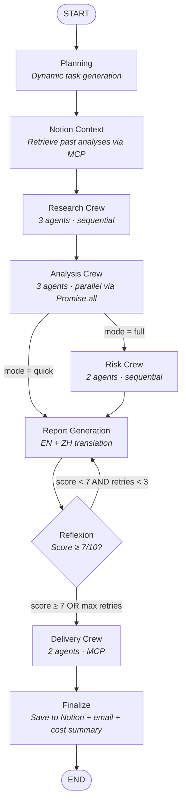

# AI Investment Analyst

A multi-agent system that automates end-to-end investment research — 10 specialized agents across 4 crews, orchestrated by a LangGraph.js state machine with Reflexion-based self-improvement and real-time market data.


## Architecture



## Technical Highlights

**Agent Patterns**
- **Reflexion** — structured self-improvement with memory across retries; evaluator uses 5-dimension rubric (completeness, data quality, analytical depth, actionability, writing), reflector generates root-cause analysis + specific action items carried forward to next attempt
- **Process Reward Model** — step-level quality scoring (not just final output), each dimension scored independently to pinpoint weaknesses
- **Dynamic Planning** — LLM generates execution plans at runtime, adapting research focus based on company and query context

**Engineering**
- **Live Data Verification** — real-time Yahoo Finance data appended as verified appendix, superseding any LLM-hallucinated figures
- **Parallel Execution** — Analysis crew runs 3 specialists concurrently via `Promise.all`, cutting latency by ~3x
- **Notion + Email Delivery** — reports auto-saved to Notion database and emailed with executive summary; direct API integration (no LLM needed for delivery) with graceful fallback when unconfigured
- **Cost Controls** — per-agent token tracking with budget enforcement; cost summary included in final output
- **Type Safety** — full TypeScript with LangGraph `Annotation` API for compile-time state validation

## Agents & Crews

| Crew | Agents | Mode | Tools |
|------|--------|------|-------|
| **Research** | Web Researcher, Data Collector, Synthesizer | Sequential | `web_search`, `news_search`, `competitor_search`, `get_stock_info`, `get_financial_history`, `notion_search_past_analyses` |
| **Analysis** | Financial Analyst, Market Analyst, Tech Analyst | Parallel | `get_stock_info`, `get_financial_history`, `web_search`, `news_search`, `competitor_search` |
| **Risk** | Risk Analyst, Compliance Analyst | Sequential | `web_search`, `news_search`, `competitor_search` |
| **Delivery** | Knowledge Manager, Distribution Coordinator | Sequential | `notion_save_analysis`, `gmail_send_report`, `gmail_search_newsletters`, `calendar_schedule_review`, `calendar_set_followup` |

## Tech Stack

| Layer | Technology |
|-------|-----------|
| Orchestration | LangGraph.js (state machine, conditional edges, checkpointer) |
| Agents | LangChain.js (tool-augmented LLM agents) |
| Streaming | Vercel AI SDK |
| LLM | DeepSeek (chat + reasoner models) |
| Finance Data | Yahoo Finance Chart API (real-time quotes, historical data) |
| Delivery | Notion API (`@notionhq/client`), Nodemailer (SMTP/Gmail) |
| External Services | Model Context Protocol — Notion, Gmail, Calendar |
| Runtime | TypeScript, Node.js |

## Quick Start

```bash
npm install

# Demo mode (no API key needed)
npx tsx src/main.ts --demo

# Full pipeline
cp .env.example .env
# Add your DEEPSEEK_API_KEY to .env
npx tsx src/main.ts --company "NVIDIA" --mode full

# Quick mode (skips risk assessment)
npx tsx src/main.ts --company "Apple" --mode quick

# Watchlist mode — analyze all 7 tracked companies
# (NVIDIA, Apple, Google, Micron, AMD, Amazon, Alibaba)
npm run watchlist             # full analysis
npm run watchlist:quick       # quick mode
```

### Notion + Email Setup (Optional)

Add to `.env` to enable auto-delivery:

```bash
# Reports auto-saved to Notion database
NOTION_API_KEY=ntn_xxx
NOTION_DATABASE_ID=xxx

# Email notification with executive summary + report attachment
SMTP_HOST=smtp.gmail.com
SMTP_PORT=465
SMTP_USER=you@gmail.com
SMTP_PASS=your-gmail-app-password
EMAIL_TO=you@gmail.com
```

When configured, each report is automatically saved to Notion and emailed after generation. When not configured, delivery is gracefully skipped — reports are still generated and saved locally.

## Example: AMD Analysis (Live Run)

Full pipeline execution — planning, 10-agent research, Reflexion self-improvement loop, real-time Yahoo Finance data, Notion + email delivery.

### Pipeline Execution

```
🎯 Target: AMD
📋 Query: Comprehensive investment analysis of AMD
⚙️  Mode: full
⏱️  Started: 2026-03-11T08:17:25Z
-----------------------------------------------------------------
  [16:17:42] 📋 Dynamic plan created: 9 tasks
  📍 Phase: planned
  [16:17:42] 📚 Historical context loaded from Notion
  📍 Phase: context_loaded
  [16:18:22] ✅ Research crew completed for AMD
  📍 Phase: research_complete
  [16:18:25] ✅ Analysis crew completed (3 analysts ran in parallel)
  📍 Phase: analysis_complete
  [16:18:31] ✅ Risk crew completed (score: 5)
  📍 Phase: risk_complete
  [16:19:11] ✅ Report generated (iteration 1)
  [16:19:38] 🪞 Reflexion: score=5/10 (attempt 1), retry=true, actions=5
  [16:20:41] ✅ Report generated (iteration 2)
  [16:21:05] 🪞 Reflexion: score=5/10 (attempt 2), retry=true, actions=5
  [16:22:06] ✅ Report generated (iteration 3)
  [16:22:33] 🪞 Reflexion: score=4/10 (attempt 3), retry=false, actions=5
  📍 Phase: reflexion_complete
  [16:22:44] 📨 Delivery complete:
    📝 Notion: ✅ saved → notion.so/320c0dfa43c981cf8bf0ee63ebcff605
    📧 Email: ✅ sent
  📍 Phase: delivered
  [16:22:44] 🏁 Workflow completed. Final report ready.
💾 English report saved to: output/amd_report.md
💾 Chinese report saved to: output/amd_report_zh.md
```

### Report Output (Verified Live Data)

The system fetches real-time data from Yahoo Finance and appends it as a verified appendix, superseding any LLM-generated figures:

| Metric | Value |
|--------|-------|
| **Company** | Advanced Micro Devices, Inc. |
| **Current Price** | $203.23 |
| **Market Cap** | $331.35B |
| **P/E Ratio (TTM)** | 78.17 |
| **Forward P/E** | 18.67 |
| **EPS (TTM)** | $2.60 |
| **Revenue (TTM)** | $34.64B |
| **Gross Margin** | 52.49% |
| **Profit Margin** | 12.52% |
| **52-Week Range** | $76.48 — $267.08 |
| **Risk Score** | 5/10 |
| **Recommendation** | HOLD |

*Data as of: 2026-03-11. Full reports: [English](output/amd_report.md) · [中文](output/amd_report_zh.md)*

### Delivery

Reports are automatically delivered to configured destinations after generation:

- **Notion** — full report saved as a rich page in Knowledge Database with structured sections, tables, and live data
- **Email** — HTML notification with executive summary, key metrics table, and risk assessment sent to configured recipients

> **Watchlist mode**: `npm run watchlist` analyzes all tracked companies (NVIDIA, Apple, Google, Micron, AMD, Amazon, Alibaba) in sequence, delivering each report to Notion + email as it completes.

## Project Structure

```
src/
├── main.ts                  # CLI entry point
├── config.ts                # Model & workflow config
├── streaming.ts             # Vercel AI SDK streaming
├── types/index.ts           # LangGraph state + domain types
├── integrations/
│   ├── notionClient.ts      # Notion API — save reports as pages
│   └── emailClient.ts       # SMTP email — report notifications
├── tools/
│   ├── searchTools.ts       # DuckDuckGo HTML search, proxy-aware (3 tools)
│   ├── financeTools.ts      # Yahoo Finance API, real-time quotes (2 tools)
│   └── mcpTools.ts          # Notion/Gmail/Calendar (6 tools, real-or-stub)
├── crews/index.ts           # 4 crews: Research/Analysis/Risk/Delivery
├── graph/
│   ├── nodes.ts             # 9 LangGraph node functions
│   └── workflow.ts          # State machine + streaming runner
├── agents/reportWriter.ts   # Report generation + EN→ZH translation
└── skills/
    ├── reflexion.ts         # Self-reflection engine
    ├── dynamicPlanner.ts    # Adaptive task planning
    ├── processReward.ts     # Step-level evaluation (PRM)
    └── costTracker.ts       # Token economics & budget
```
